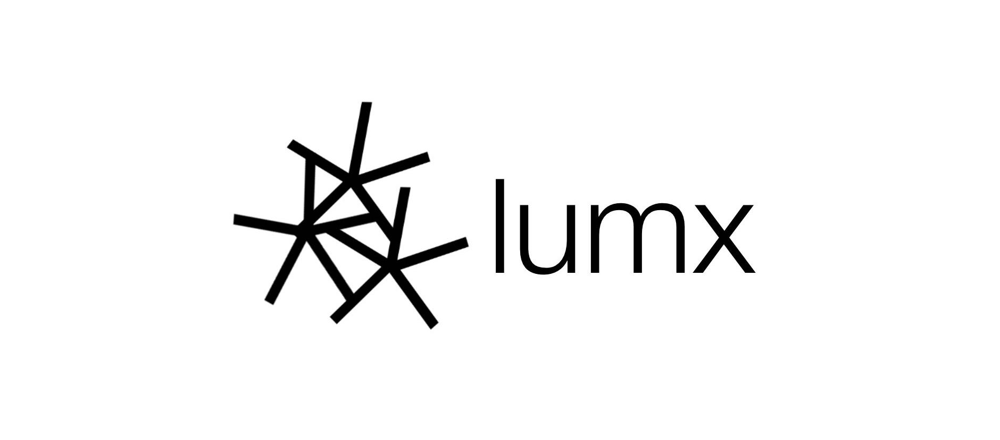

# lumx -- open-source encrypted chatrooms

> **lumx** is in HEAVY HEAVY alpha, expect bugs and not everything will work. 
> all issues and prs welcome!!!

<h1>checklist</h1>

- [ ] speed optimisation (I)
- [ ] lumx webui - (II)

<h2>features</h2>
1. c2c encryption 
2. per-room salt 
3. reverse proxy [cloudflared] 
4. servers w/ channels
5. and more!

<h3>setup</h3>
please check the wiki (https://github.com/atmo1lost/lumx/wiki)

<h2>what is our vision</h2>
<h4>our main goal with **lumx** is to get past all these survailence laws  ruining our privacy and making our chats less and less private.</h4>

<h3>if you are going to fork</h3>
<h4>at the bottom of the forked repo, please include a list of the edits you have made,  dont just change the name and give yourself the credit. once youve done that, do whatever you like!</h4>

## credits
**founder**: atmo1lost (me)  
**logo designer**: [luvpeng](https://pengis.online/home)
#
