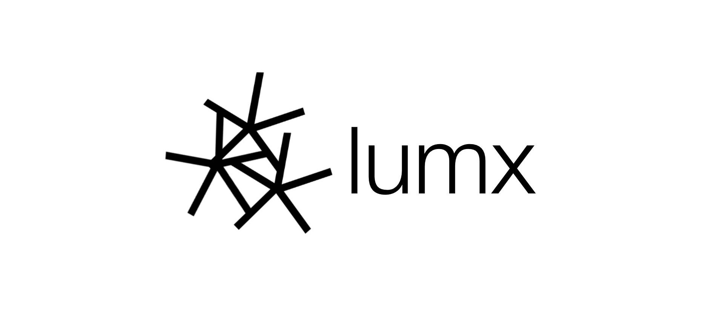

# lumx -- open-source encrypted chatrooms

> **lumx** is in HEAVY HEAVY alpha, expect bugs and not everything will work. 
> all issues and prs welcome!!!

<h2>features</h2>
1. c2c encryption 
2. reverse proxy [cloudflared] 
3. servers 
 and more coming very soon!

<h1>checklist</h1>

- [ ] rate limiting
- [ ] mobile install tutorial

<h3>setup</h3>
please check the wiki (https://github.com/atmo1lost/lumx/wiki)

---

<h3>legal</h3>
please check the legal notice @ https://github.com/atmo1lost/lumx/LEGAL.md

<h2>what is our vision</h2>
<h4>our main goal with **lumx** is to help people keep their conversations private, even as surveillance and data collection keep expanding.  we think privacy shouldn't be something you have to fight for.</h4>

<h3>if you are going to fork</h3>
<h4>at the bottom of the forked repo, please include a list of the edits you have made,  dont just change the name and give yourself the credit. once youve done that, do whatever you like!</h4>

## credits
**founder**: atmo1lost (me)  
**logo designer**: [luvpeng](https://pengis.online) 
#
